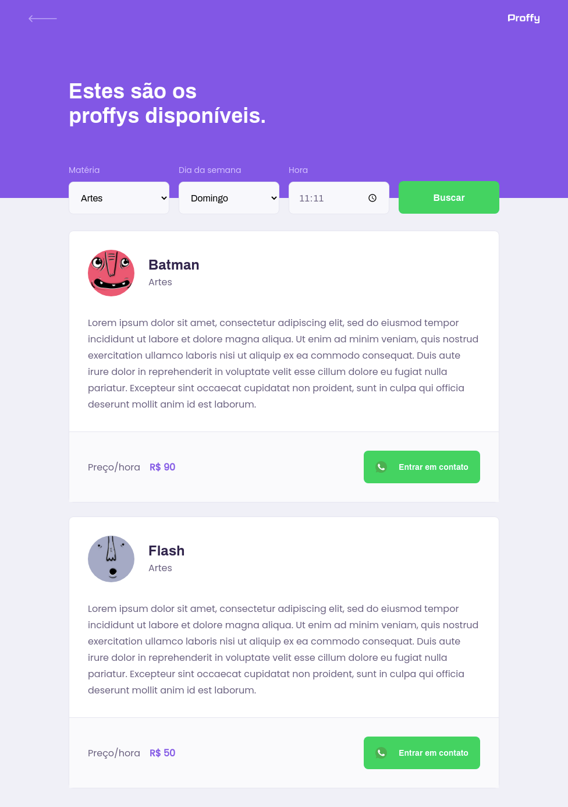
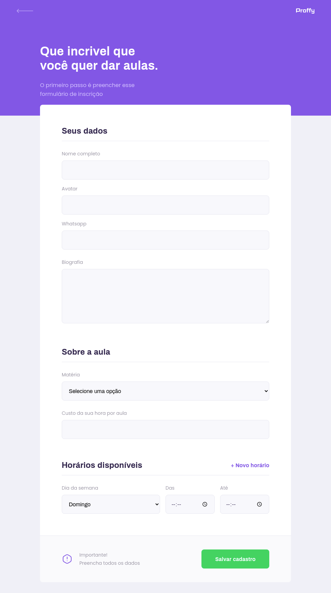
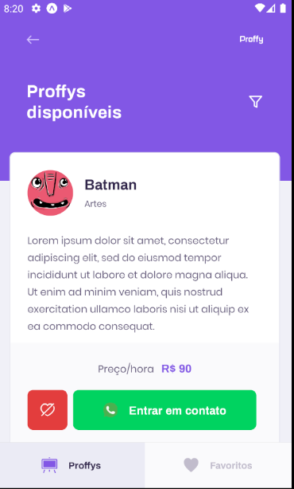

  
    

# Projeto

Projeto tem como objetivo conectar alunos a professores para aulas particulares, possibilitando o cadastro de professores e suas aulas, busca de aulas disponíveis e contato via Whatsapp.

Este projeto foi desenvolvido durante a next level week #2 da Rocketseat.

## Principais tecnologias aplicadas

- ReactJS
- React Native
- TypeScript
- HTML5 e CSS3
- NodeJS
- Expo

## Design

### Web

<table>
  <tr>
    <td colspan="1">Home</td>
    <td colspan="1">Estudar</td>
    <td colspan="1">Dar aulas</td>
  </tr>
  <tr>
    <td></td>
    <td></td>
    <td></td>
  </tr>
</table>

### Mobile (Android)

<table>
  <tr>
    <td colspan="1">Home</td>
    <td colspan="1">Estudar</td>
    <td colspan="1">Dar aulas</td>
  </tr>
  <tr>
    <td></td>
    <td></td>
    <td></td>
  </tr>
</table>

## Como executar o projeto

### Server (API / Backend)

- cd server
- yarn install
- yarn knex:migrate
- yarn start
- http://localhost:3333/

### Web (Frontend)

- cd web
- yarn install
- yarn start
- http://localhost:3000/

### Mobile (Android/IOS)

- cd mobile
- yarn install
- expo start
- instalar expo no emulador ou device
